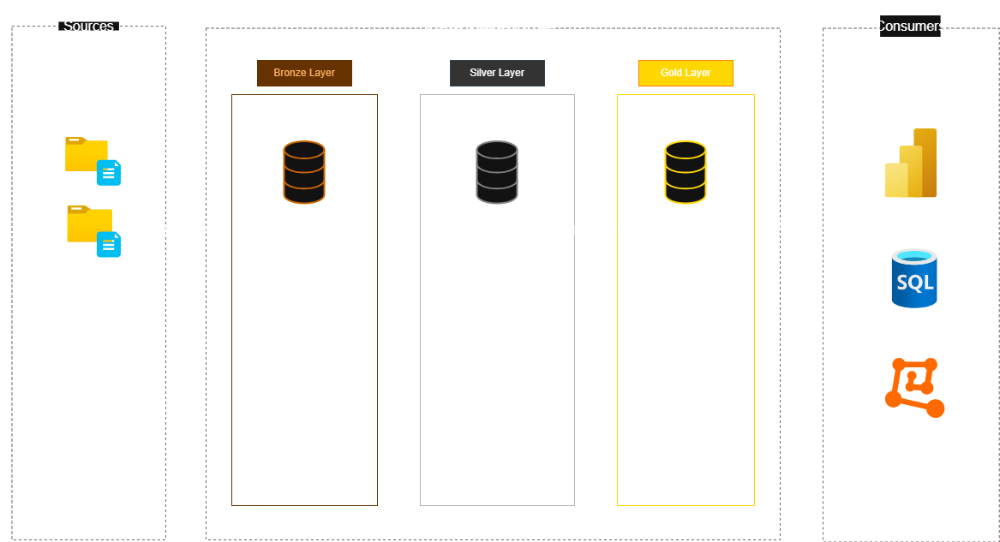

# 🏗️ Modern Data Warehouse & Analytics Project

Welcome to my **Modern Data Warehouse and Analytics Project** repository! 🚀  
This project demonstrates the end-to-end implementation of a data warehouse solution using SQL Server, following industry best practices in data engineering and analytics.

The project covers the full lifecycle — from raw data ingestion to analytical modeling and business insights generation.

---

## 🏛️ Data Architecture

This project follows the **Medallion Architecture** design pattern (Bronze, Silver, Gold layers) to ensure scalable, maintainable, and analytics-ready data processing.

### 🥉 Bronze Layer – Raw Data
- Stores raw data exactly as received from source systems.
- Data is ingested from **CSV files** (ERP & CRM systems).
- No transformations are applied at this stage.
- Purpose: Preserve source data for traceability and auditing.

### 🥈 Silver Layer – Cleaned & Standardized Data
- Data cleansing and transformation.
- Handling:
  - Null values
  - Data type corrections
  - Standardization
  - Deduplication
- Data is structured and normalized for analytical preparation.

### 🥇 Gold Layer – Business-Ready Data
- Data modeled into a **Star Schema**.
- Creation of:
  - Fact tables
  - Dimension tables
- Optimized for analytical queries and reporting.

---

## 📖 Project Overview

### 🔹 1. Data Engineering
- Designed and implemented a modern SQL-based data warehouse.
- Built structured ETL pipelines.
- Integrated ERP and CRM datasets.
- Ensured data quality before analysis.

### 🔹 2. Data Modeling
- Designed a Star Schema.
- Developed:
  - Fact tables (Sales)
  - Dimension tables (Customers, Products, Date, etc.)
- Optimized for performance and scalability.

### 🔹 3. Analytics & Reporting
- Developed SQL-based analytical queries.
- Generated insights on:
  - Customer behavior
  - Product performance
  - Sales trends
- Delivered business-ready metrics for decision-making.

---

## 🎯 Skills Demonstrated

This project highlights practical experience in:

- SQL Development  
- Data Warehousing  
- ETL Design & Implementation  
- Data Modeling (Star Schema)  
- Data Cleaning & Transformation  
- Analytical Query Writing  
- Data Architecture Design  

---

## 🛠️ Tools & Technologies Used

- SQL Server Express  
- SQL Server Management Studio (SSMS)  
- T-SQL  
- Draw.io (for architecture & modeling diagrams)  
- Git & GitHub  
- CSV Data Sources  

---

## 📂 Repository Structure
data-warehouse-project/
│
├── datasets/
│ ├── erp/
│ └── crm/
│
├── Documnets/
│ ├── data_architecture.drawio
│ ├── data_flow.drawio
│ ├── data_models.drawio

│
├── Scripts/
│ ├── bronze/
│ ├── silver/
│ └── gold/
│
├── Checks/
│
├── README.md
└── LICENSE

---

## 🚀 Project Requirements

### 🏗️ Building the Data Warehouse

**Objective:**  
Develop a SQL Server-based modern data warehouse to consolidate ERP and CRM sales data into a unified analytical model.

**Key Specifications:**

- Import data from two source systems (ERP & CRM).
- Clean and standardize data before analysis.
- Integrate data into a single analytical model.
- Focus on latest dataset (no historization required).
- Document architecture and data model clearly.

---

### 📊 Business Intelligence & Analytics

**Objective:**  
Deliver SQL-based analytical insights to support business decision-making.

**Insights Generated:**
- Customer segmentation analysis
- Product performance metrics
- Revenue and sales trend analysis
- Top-performing products and customers

---

## 📈 Key Outcomes

✔️ Implemented a layered Medallion architecture  
✔️ Built a clean and scalable ETL pipeline  
✔️ Designed a performant Star Schema  
✔️ Delivered meaningful business insights using SQL  
✔️ Documented full data flow and modeling process  

---

## 🛡️ License

This project is licensed under the MIT License.  
You are free to use, modify, and share with proper attribution.

---

## 👩‍💻 About Me

Hi 👋 I'm **Reem Adel Mohamed**  
Computer Science Student | Data Engineering & Data Analytics Enthusiast  

I’m passionate about building data systems, designing analytical solutions, and transforming raw data into actionable insights.

📌 Connect with me on LinkedIn  
📌 Check out more of my projects on GitHub  
